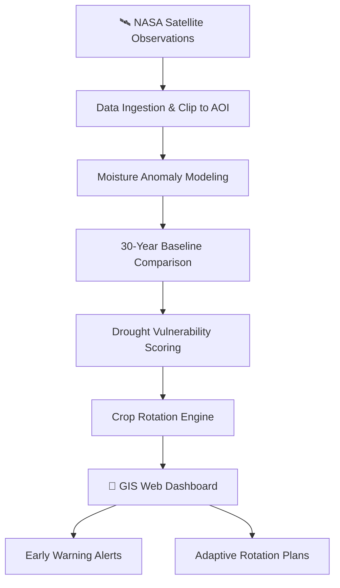

<div align="center">

# 🌾 VaporPath Agri-Planner

### *Connecting Continental Moisture Dynamics to Ground-Level Crop Resilience*

[](https://www.spaceappschallenge.org/)
[](https://www.spaceappschallenge.org/)
[](https://www.spaceappschallenge.org/)
[](#)
[](#)

</div>

---

## 🌍 Overview

**VaporPath Agri-Planner** is a data-driven, web-based climate decision-support system that bridges large-scale atmospheric moisture dynamics with ground-level soil hydrology — delivering **3–4 week early warnings** of drought risk and **adaptive crop rotation recommendations** at field scale.

By harnessing the power of NASA's Earth observation satellites and open data platforms, VaporPath empowers farmers, cooperatives, and agricultural planners to make **proactive, science-backed decisions** before drought conditions take hold — protecting yields, conserving water, and building long-term food security.

> **Challenge Track:** Field Shift — Adapting Farms with NASA Data  
> **Team Name:** The\_Alchemist

---

## 🚨 The Problem

Farmers worldwide face an invisible threat — atmospheric moisture imbalances that trigger devastating droughts **weeks before** visible crop stress appears. Traditional irrigation planning reacts *after* damage occurs. Smallholders in particular lack access to the sophisticated tools needed to predict these patterns in advance.

- 🌡️ Agricultural droughts are increasing in frequency and severity due to climate change
- 📉 Crop failures cost billions annually and threaten food security for billions of people
- 🛰️ Meanwhile, NASA's satellite constellation captures the exact data needed to predict these events — but it remains inaccessible to the people who need it most

---

## 💡 Our Solution

VaporPath Agri-Planner makes NASA Earth science **actionable at the field level**:

```
Satellite Data  →  Anomaly Detection  →  Risk Scoring  →  Actionable Recommendations
(SMAP, GPM, ECOSTRESS, Landsat, POWER)
```

The platform ingests, processes, and visualizes multi-source NASA datasets to produce drought vulnerability scores and rotation plans that farmers can act on — **weeks before crisis strikes**.

---

## 🛰️ NASA Data Sources

| Dataset | Agency | Role in VaporPath |
|---|---|---|
| **SMAP** | NASA JPL | Root-zone soil moisture monitoring |
| **GPM IMERG** | NASA / JAXA | Precipitation anomaly detection |
| **ECOSTRESS ESI** | NASA JPL | Canopy evaporative stress index |
| **Landsat NDVI / LST** | NASA / USGS | Crop health validation & land surface temperature |
| **NASA POWER** | NASA LaRC | Solar radiation, humidity & temperature baselines |

---

## ⚙️ How It Works



### 🔄 Core Pipeline

1. **Data Ingestion** — Automated fetch and spatial clipping of NASA datasets to the user's field boundary
2. **Anomaly Detection** — Moisture anomaly modeling benchmarked against 30-year climatological baselines
3. **Risk Scoring** — Multi-layer drought vulnerability index combining soil moisture, evapotranspiration stress, and precipitation deficits
4. **Recommendation Engine** — Adaptive crop rotation suggestions optimized for water efficiency and yield resilience
5. **Visualization** — Interactive GIS web dashboard displaying vulnerability maps, trend charts, and actionable plans

---

## 🖥️ Planned Web Application Features

The following features represent our current development scope. As the project evolves and new ideas emerge through research and testing, additional capabilities will be incorporated.

**Core Features (Planned)**

- 🗺️ **Interactive GIS Map** — Draw or upload your field boundary to receive a spatially localized drought forecast
- 📊 **Drought Risk Dashboard** — Real-time vulnerability scores with historical anomaly trend overlays
- 🔄 **Crop Rotation Planner** — Data-driven rotation recommendations calibrated to projected water availability
- ⏰ **Early Warning System** — 3–4 week predictive alerts delivered before drought onset
- 📱 **Responsive Design** — Fully accessible across desktop, tablet, and mobile browsers

**Under Consideration *(subject to scope and time)*

- 🌱 **Soil Moisture Trend Viewer** — Field-level time-series visualization of SMAP root-zone moisture
- 📤 **Report Export** — Downloadable PDF summaries for farmers and cooperatives
- 🔔 **SMS / WhatsApp Alerts** — Push notifications for areas with limited internet access
- 🌍 **Multilingual Interface** — Localised UI for non-English-speaking farming communities
- 🤝 **Cooperative Mode** — Shared dashboards for agricultural cooperatives managing multiple fields

> *This feature list will be refined as development progresses. Not all items under consideration are guaranteed to ship within the challenge timeframe.*

---

## 👥 Target Users

| User Group | Use Case |
|---|---|
| **Commercial Farms** | Precision irrigation scheduling & yield optimization |
| **Smallholder Farmers** | Accessible, plain-language drought alerts |
| **Agricultural Cooperatives** | Regional water resource planning |
| **Policy Planners** | Food security risk mapping at scale |

---


## 🌱 Impact & Vision

VaporPath Agri-Planner directly contributes to:

| Goal | How VaporPath Helps |
|---|---|
| 💧 **Water Conservation** | Reduces over-irrigation through precision deficit detection |
| 🌾 **Food Security** | Protects crop yields through proactive rotation planning |
| 📡 **Open NASA Science** | Translates complex satellite data into decisions farmers can act on |
| 🌐 **Climate Adaptation** | Builds agricultural resilience against an increasingly volatile climate |

---

## 👨‍🚀 Team — The Alchemist

> *Turning raw satellite data into gold for the world's farmers.*

---

## 📄 License

This project is developed for the NASA Space Apps Challenge. All NASA data is used in accordance with [NASA's Open Data Policy](https://www.nasa.gov/open/data.html).

---

<div align="center">

**🌍 VaporPath Agri-Planner — Because every crop decision starts with understanding the sky.**

[](https://earthdata.nasa.gov/)
[](https://www.spaceappschallenge.org/)

</div>
